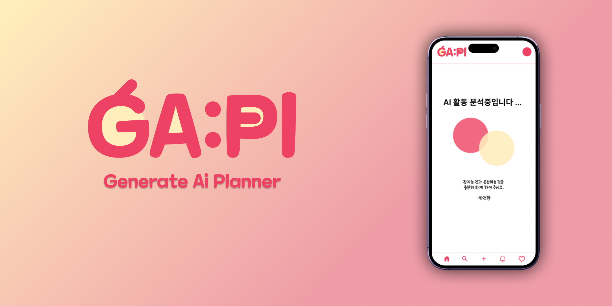
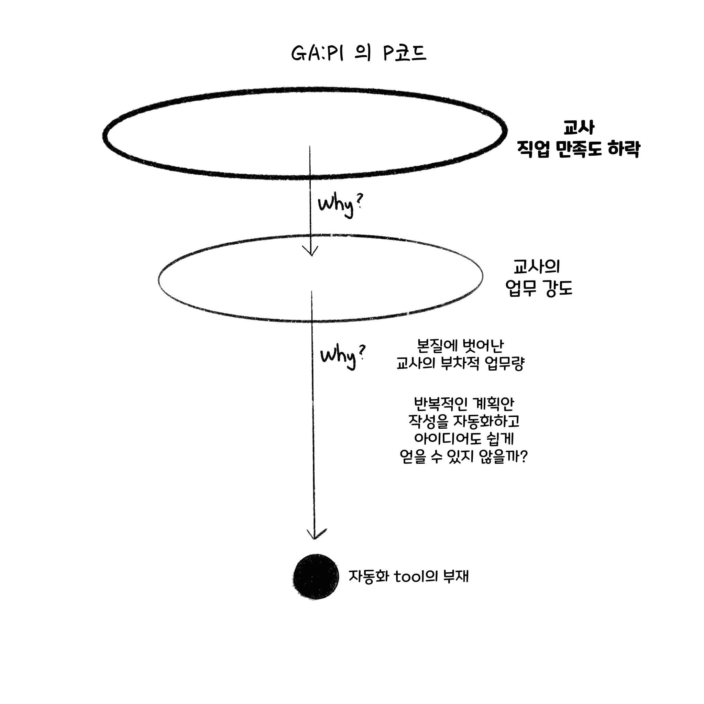
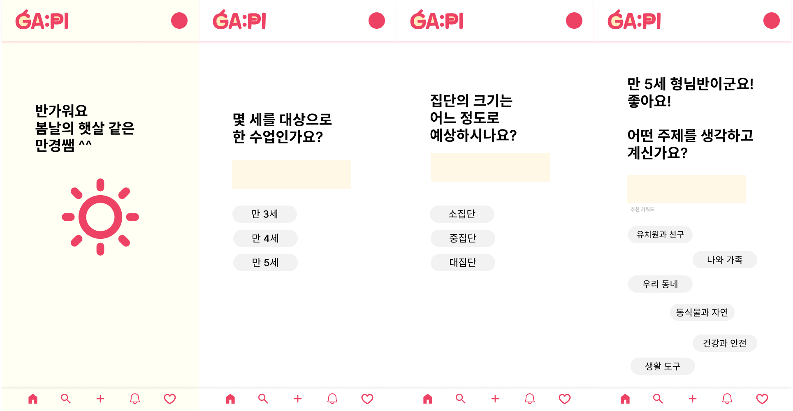

  <h1>GA:Pl</h1>
  <strong>Generate Ai Planner</strong>
  
for every early childhood educators

  

# Tech Stack

# Frontend

- React
- Next.js
- Typescript
- Tailwind css
- Vercel

 

## Pcode

서류 작업은 오래 걸립니다.  
  교육 계획안도 마찬가지이죠. 
서류 작성은 교사에게 부차적입니다. 
오랜 시간 쓰지 마세요. 다 GA:Pl에게 맡기세요 :) 

# Features in this application

## **1. AI generate**

대화형으로 AI 계획안을 작성하는 페이지입니다.

 

---

## **2. Detail**

세부 교육계획안을 보여주는 페이지입니다.

 

---

## **3. write planner**

처음부터 직접 교육계획안을 작성하는 페이지입니다.

 

---
 

> **Deployment**
> 
개발 진행중..

<!-- TODO: add image -->

 

## Articles

[Blog](https://velog.io/@mikio/series/Gapple)
