

  <h1>Gapple</h1>
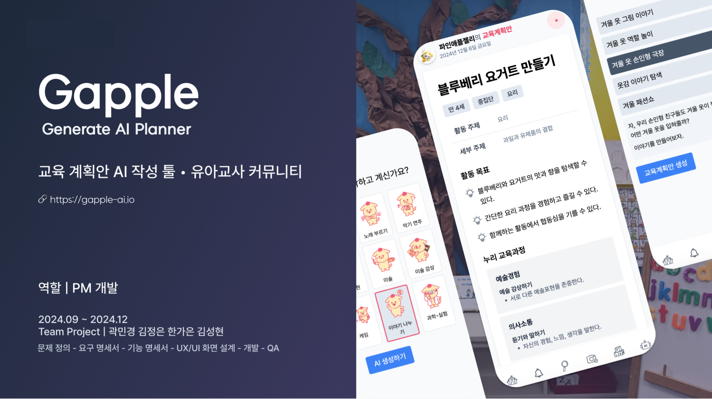

<strong>Generate Ai Planner</strong>

  
for every early childhood experts

  
<h1>기획</h1>
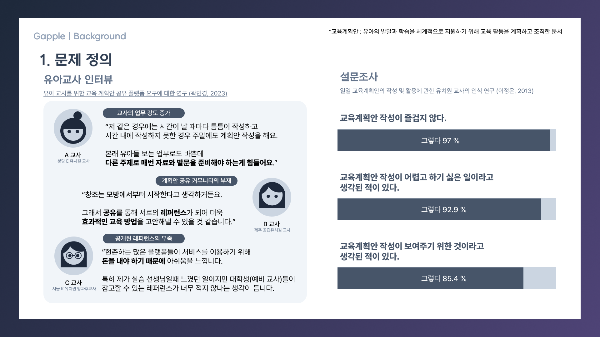

[유아 교사를 위한 교육계획안 공유 플랫폼 요구에 대한 연구 (곽민경, 2023)](https://drive.google.com/file/d/1B9UcVY7peVl795ABfRgQQ7j6qRQ719FN/view?usp=drive_link)

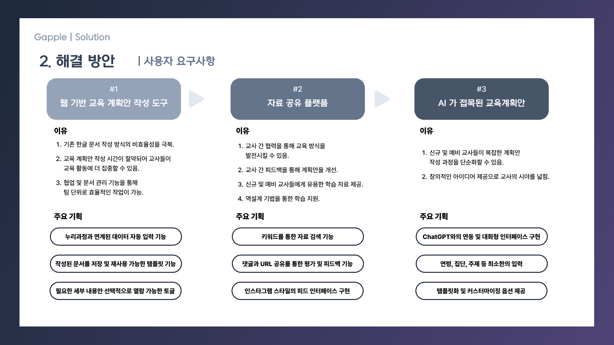
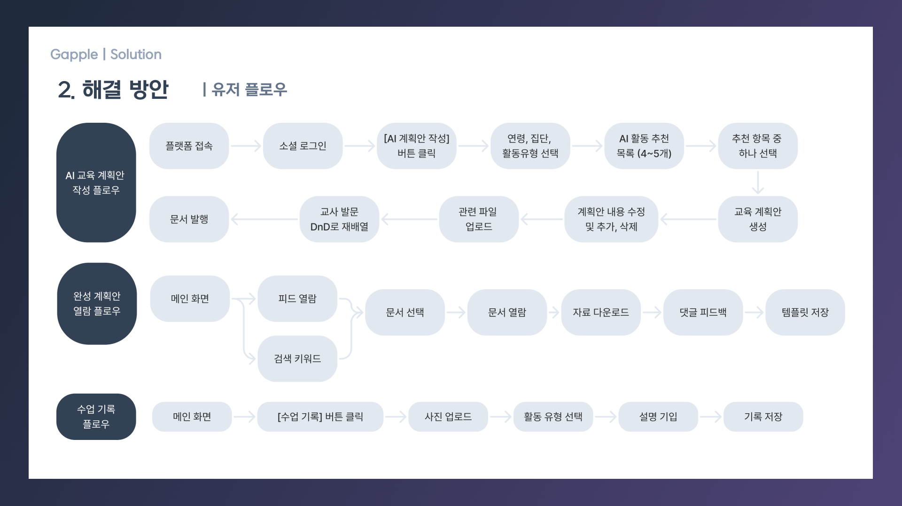
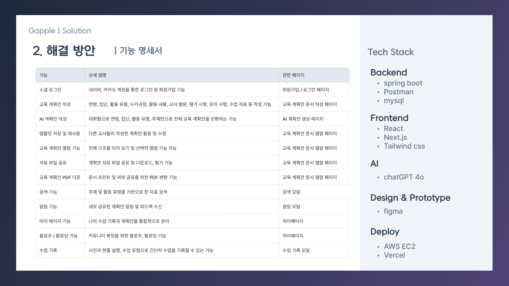

 

# Features

## **1. 교육계획안 작성 툴**

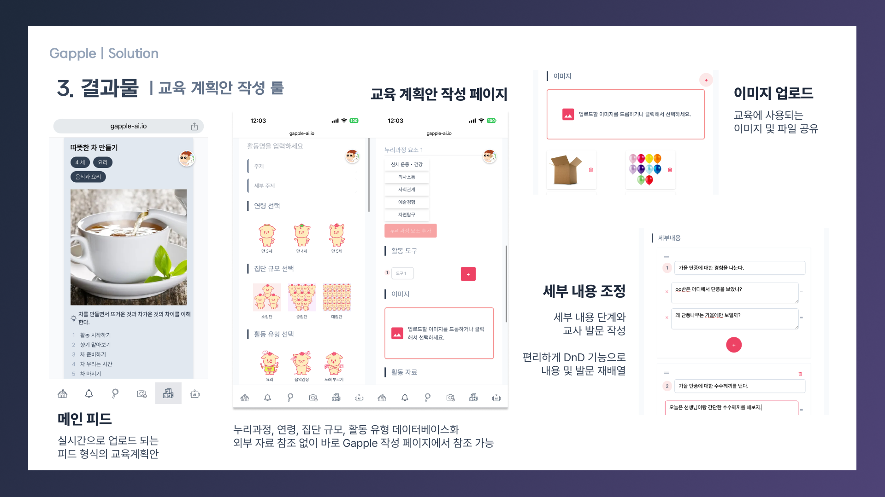

처음부터 직접 교육계획안을 작성하는 페이지입니다.

 

## **2. AI 교육 계획안**

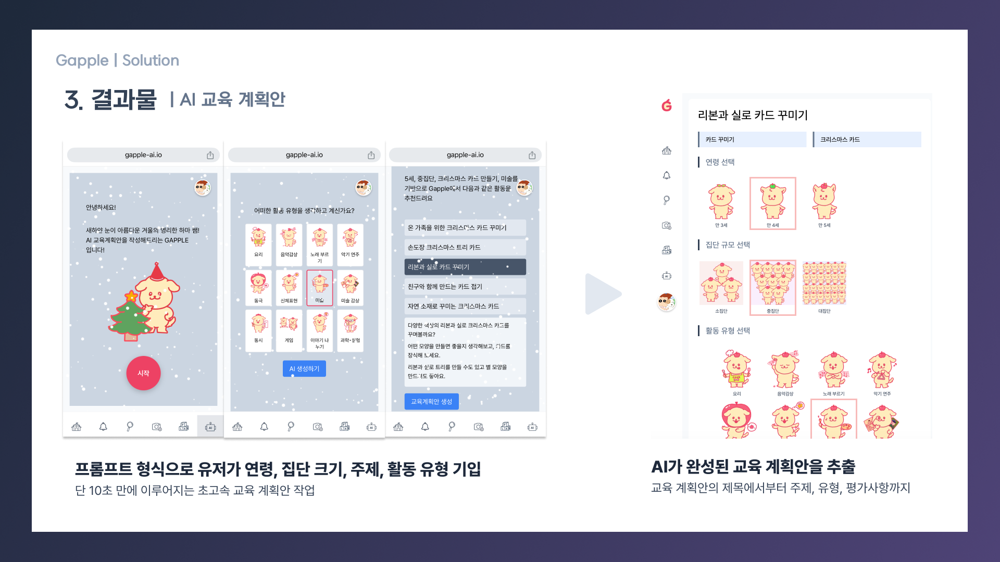

GPT 4o의 API를 활용하여 대화형으로 교육계획안을 생성할 수 있는 페이지입니다.

 

## **3. 교육계획안 열람 페이지**

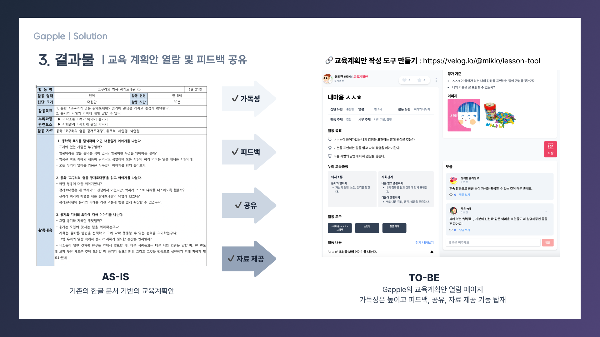

가독성과 편리함을 강조한 Gapple의 교육계획안 열람 페이지입니다.

댓글 피드백, url 공유, 자료 제공 기능 등을 이용해보세요!

 

 

## Deployment

> 👇👇👇
>
> https://gapple-ai.io

[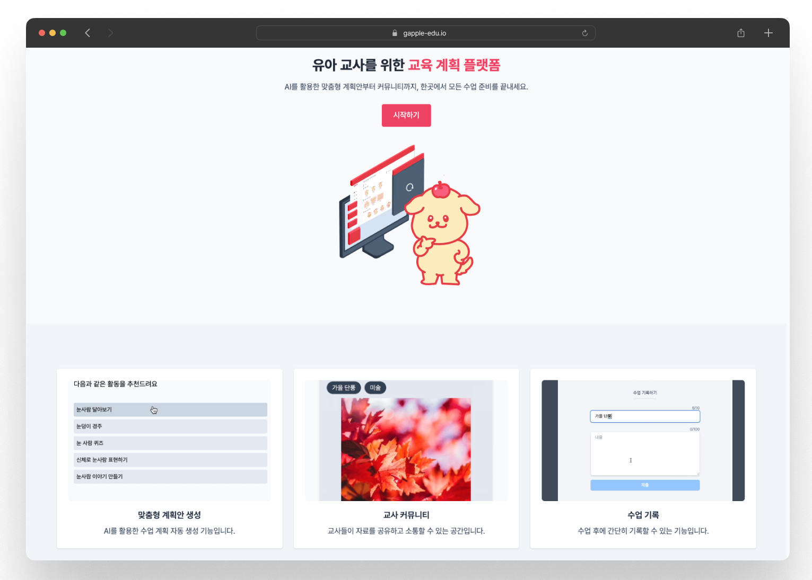](https://gapple-ai.io)

 

## Evaluation

> ### 긍정적 피드백
>
> 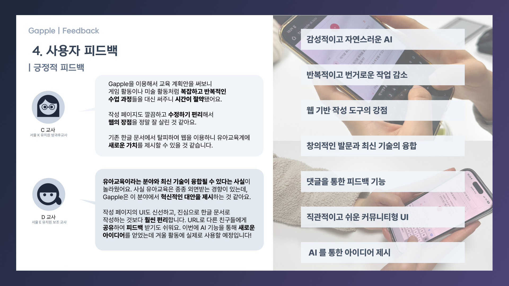

> ### 부정적 피드백
>
> 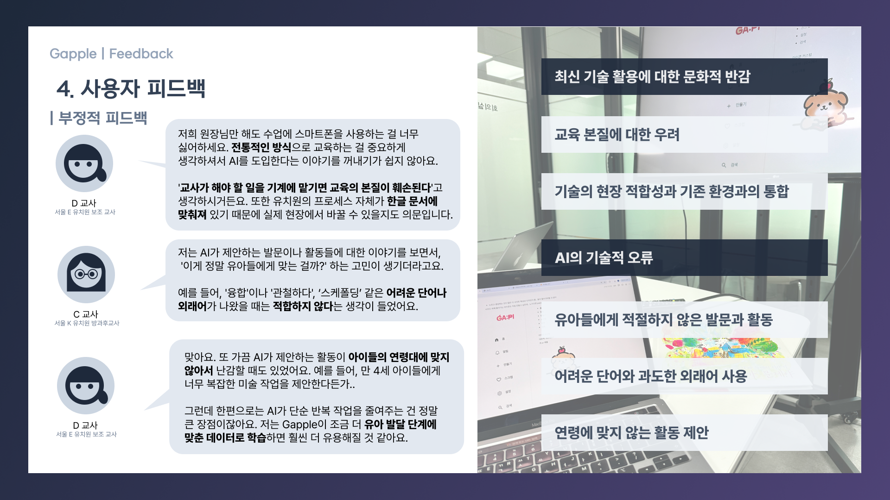

## Vision

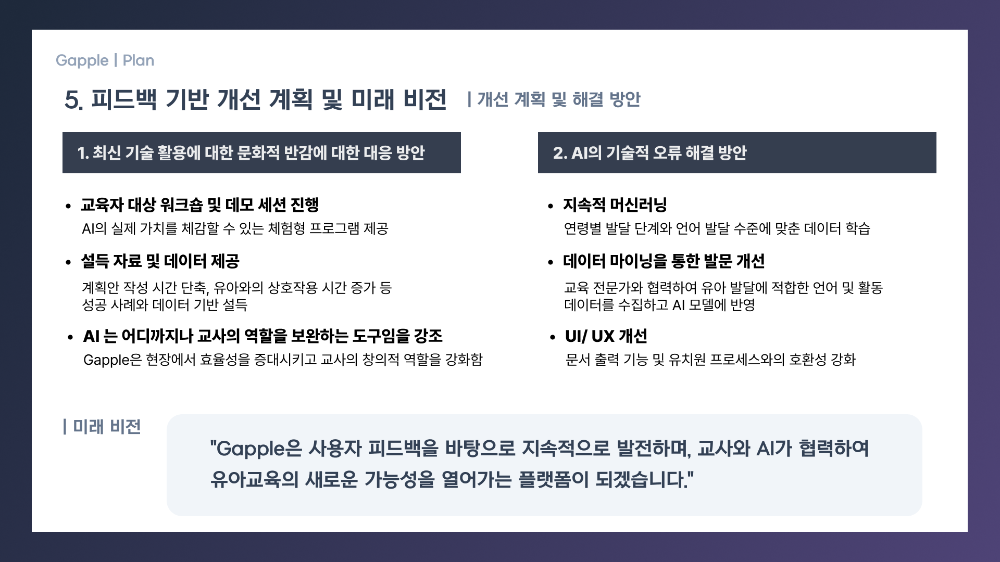

## Articles

[1. 소셜 로그인 구현](https://velog.io/@mikio/npmMigratepnpm)

[2. React에서 토글 만들기 (전체 토글 버튼, UI 개선)](https://velog.io/@mikio/ReactToggle)

[3. 교육계획안 작성 도구 만들기](https://velog.io/@mikio/lesson-tool)

[4. @hello-pangea/dnd로 드래그 앤 드롭 구현하기 (feat. 리스트 재정렬 , 중첩 구조)](https://velog.io/@mikio/hello-pangeadnd)
